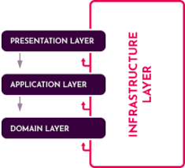

# ZFramework

Solution with different projects that provide **cross-cutting functionalities** for a n-layered Clean Architecture .NET 6 project.

## Layers

* **Presentation Layer**: Provides an interface to the user. Uses the Application Layer to achieve user interactions.
  
* **Application Layer**: Mediates between the Presentation and Domain Layers. Orchestrates business objects to perform specific application tasks. Implements use cases as the application logic. It uses Data Transfer Objects to get data from and return data to the presentation layer.
  
* **Domain Layer**: Includes business objects and the core (domain) business rules. It can also trigger Domain Events. It defines Repository Interfaces to read and persist entities from the data source. This is the *heart* of the application. 
  
* **Infrastructure Layer**: Provides generic technical capabilities that support higher layers mostly using 3rd-party libraries. It implements the repository interfaces using Entity Framework Core to actually work with a real database. It may also include an integration to send emails.

## Features
* N-layered clean architecture
* Entity Framework Core - Code first approach
* Postgres SQL database
* Sqlite database
* Auditing properties - Creation, modification and deletion
* Repository pattern - Generic
* Serilog - File and Graylog sinks
* Swagger UI
* Custom exception handling middleware
* Automapper - DTOs
* Filter, sort and pagination options
* Scrutor - Assembly scanning for DI
* CRUD operations - Generic
* VSIX - Autogenerate boilerplate files
* Sample project
* MediatR pipeline - Domain Events

## Next steps
* [x] Tests
* [X] JWT information
* [ ] Database seeding
* [ ] Event bus (RabbitMQ)
* [ ] API sync.

## Dependencies
* .NET 6
* Serilog
* Automapper
* Swagger
* Scrutor
* MediatR
* Entity Framework Core
* XUnit
* Fluent Assertions
* Coverlet
* Moq

## How to run sample project
* ### Apply the migrations, if any
    - Check the **connection string** in the `appsettings.json` file under the `ApplicationDbContext` section.
    - Right click to the `.Migrations` project and select **Set as StartUp Project**
    - Open the **Package Manager Console**, select `.Migrations` project as the Default Project and run the `Add-migration` command: `add-migration migration-name`

* ### Update database
    - Right click to the `.Migrations` project and select **Set as StartUp Project**
    - Open the **Package Manager Console**, select `.Migrations` project as the Default Project and run the `Update-Database` command.
    - This will create a new database based on the configured connection string. 

* ### Run the application
    - Ensure that the `.Host` project is the startup project and run the application which will open a Swagger UI.

## Conventions
* https://docs.microsoft.com/en-us/dotnet/standard/design-guidelines/general-naming-conventions

## References
* https://github.com/dotnet-architecture/eShopOnContainers
* https://github.com/ardalis/CleanArchitecture
* https://github.com/aspnetboilerplate/aspnetboilerplate
* https://docs.microsoft.com/es-es/dotnet/architecture/microservices/microservice-ddd-cqrs-patterns/